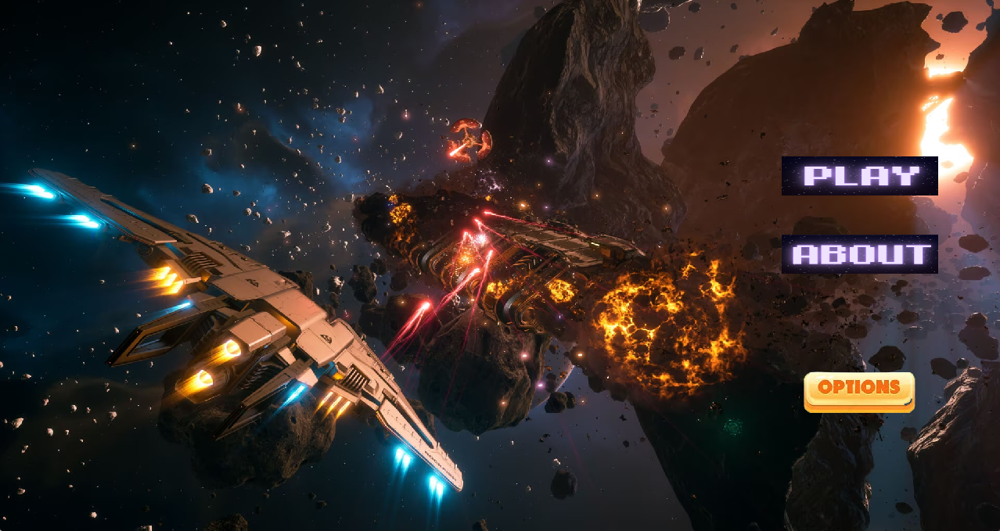
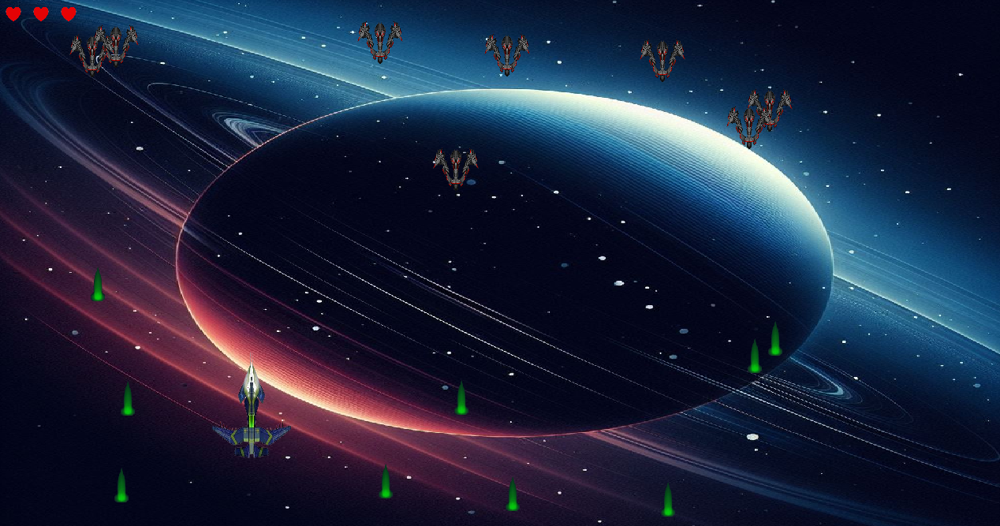
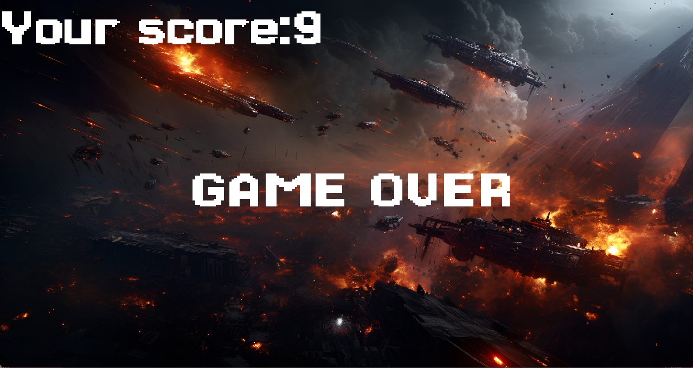
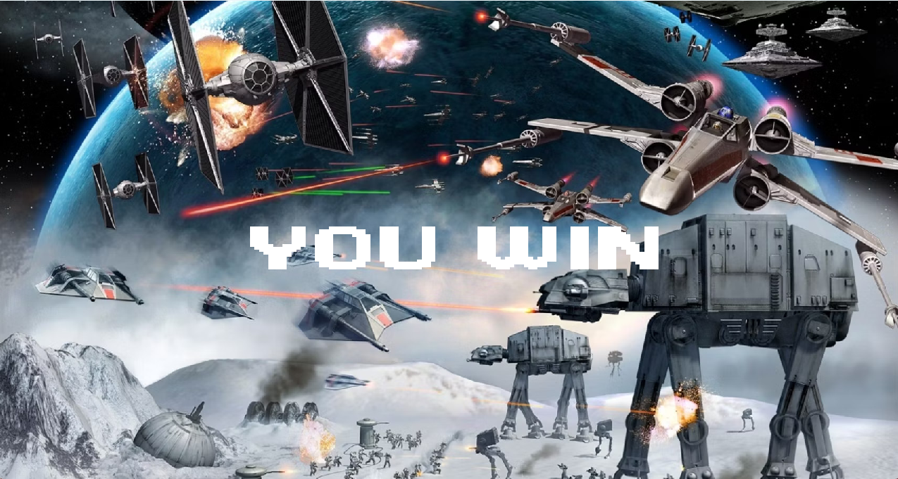

# Thông tin cá nhân
- Họ và tên: Nguyễn Phú Thái
- MSSV: 23020153
# Giới thiệu game
Trái đất đang phải đối mặt với nguy cơ bị xâm lược từ lũ ngoài hành tinh xấu xa, hãy đứng lên chiến đấu và bảo vệ tương lai của chúng ta!!!
# Video game
Bạn có thể xem video tại link : https://youtu.be/W_Rq8dIWRBE
# Một số hình ảnh trong game
## Main menu

## Màn chơi

# Các kĩ thuật sử dụng
- In ảnh
- Phát âm thanh
- In chữ
- Xử lí va chạm
- Toán học
- Xử lí đầu vào từ cả bàn phím và chuột
# Ngưỡng điểm dự kiến
Em cảm thấy bài của mình nằm trong mức từ 7.5-8.5
## Một vài lí do để đạt mức điểm đó
- Game không tham khảo code của nguồn nào, chỉ tham khảo một vài thuật toán khó và các câu lệnh cơ bản của thư viện SDL
- Hình ảnh đẹp, phù hợp với chủ để của game
- Nhạc nền, sound effect đúng chủ đề của game, khơi gợi sự hứng thú cho người chơi
- Gameplay với nhiều màn chơi khác nhau
- Có tạm dừng game
- Đa dạng nhân vật
